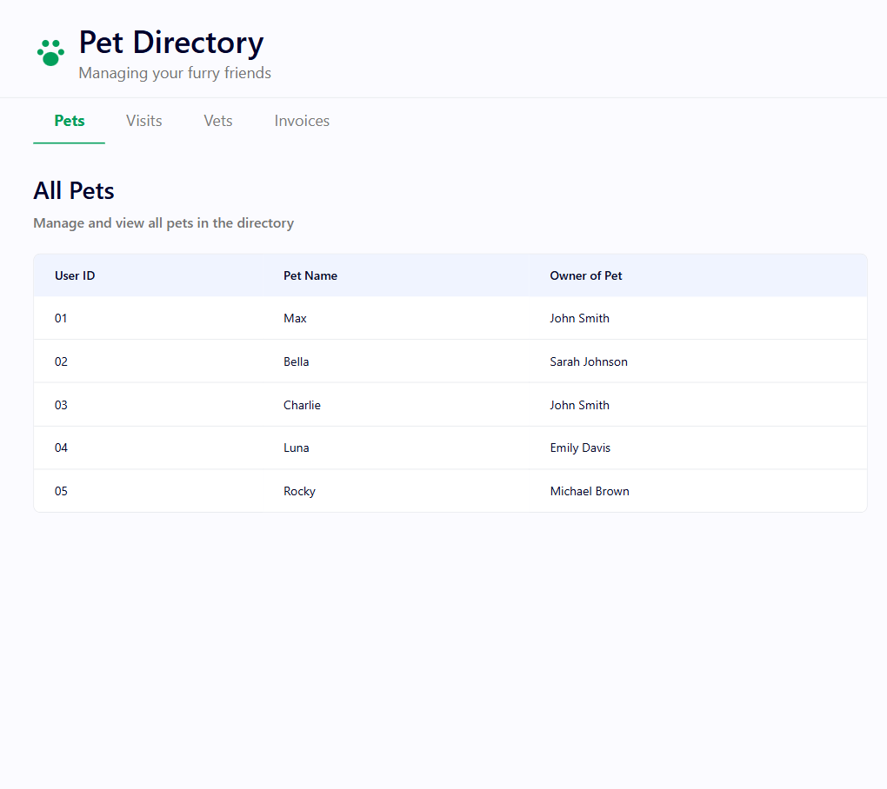
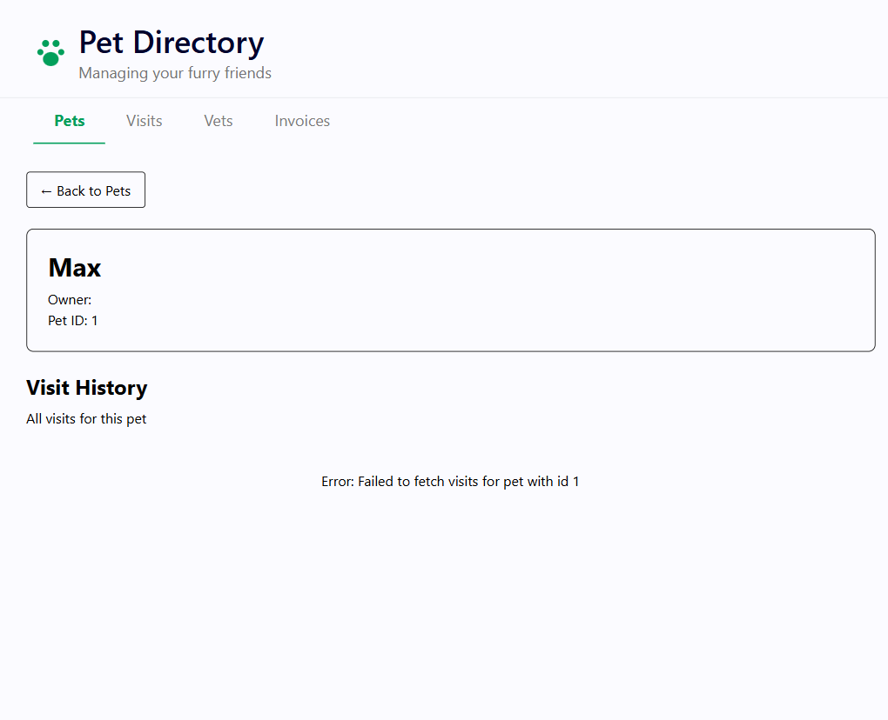
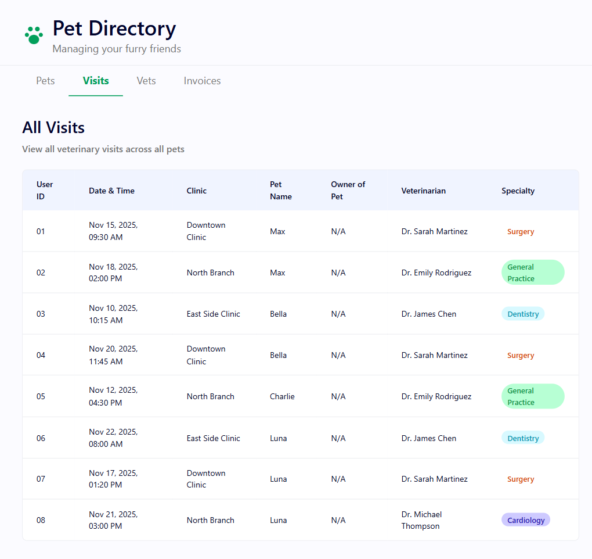
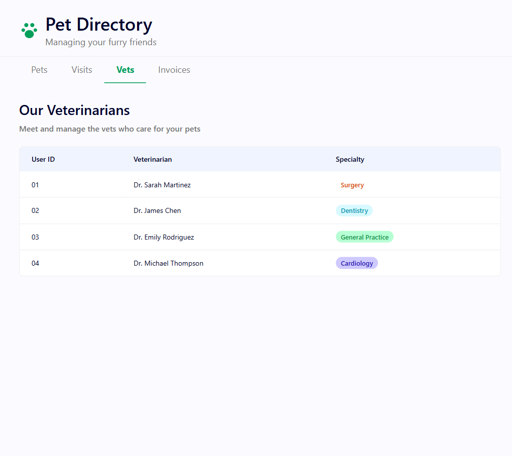
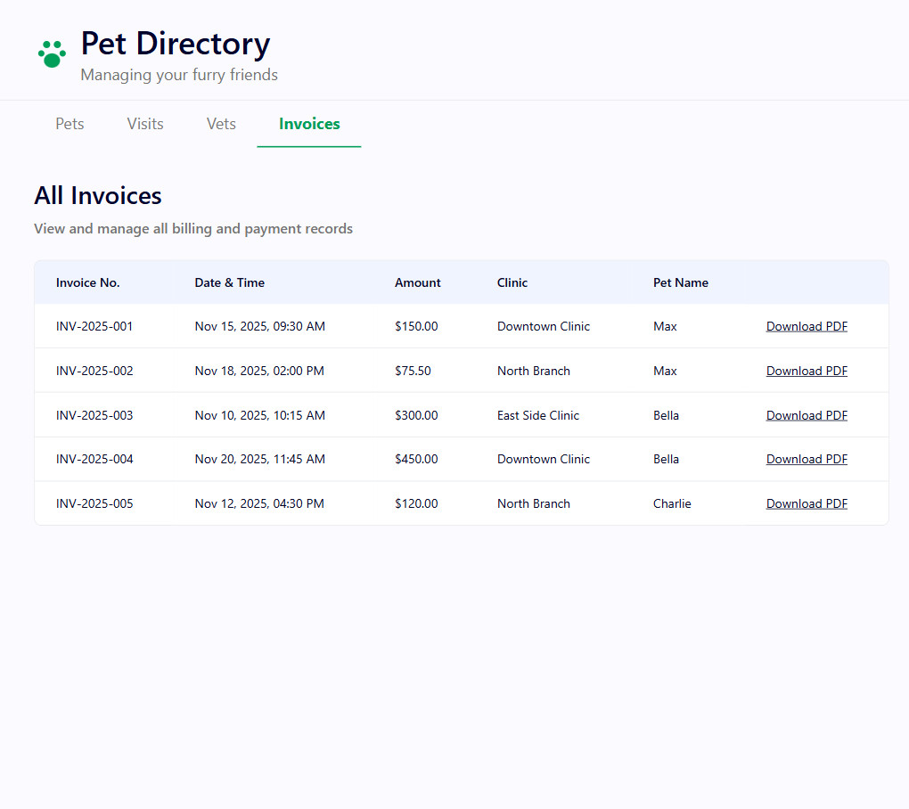

# PetClinic User Guide

## Overview

**Pet Directory** is a web application for managing pets, their veterinary visits, vets, and invoices. Use it to look up pets and their owners, browse visit history, check available veterinarians, and download billing records.

---

## Getting Started

Open the app at `http://localhost:5173`. The header displays the **Pet Directory** logo and tagline. Below it, a tab bar lets you switch between **Pets**, **Visits**, **Vets**, and **Invoices**. The active tab is highlighted in green with an underline indicator.

---

## Pets

### Viewing Pets

The default landing page shows the **All Pets** list — a table of every registered pet. Columns: **User ID**, **Pet Name**, and **Owner of Pet**. Click any row to open that pet's detail page.

### Pet Detail

Shows the selected pet's name and owner along with their complete visit history. Click **← Back to Pets** to return to the list.

---

## Visits

### Viewing Visits

The **All Visits** page displays every veterinary visit across all pets. Columns: **User ID**, **Date & Time**, **Clinic**, **Pet Name**, **Owner of Pet**, **Veterinarian**, and **Specialty**. The **Specialty** column uses colour-coded badges — e.g. orange for Surgery, teal for Dentistry, green for General Practice, purple for Cardiology. Click a row to see the full visit detail.

---

## Vets

### Viewing Vets

The **Our Veterinarians** page lists all vets with their **User ID**, **Veterinarian** name, and **Specialty** badge. This is a read-only directory.

---

## Invoices

### Viewing Invoices

The **All Invoices** page lists all billing records. Columns: **Invoice No.**, **Date & Time**, **Amount**, **Clinic**, and **Pet Name**. Click the **Download PDF** link on any row to download that invoice as a PDF.

